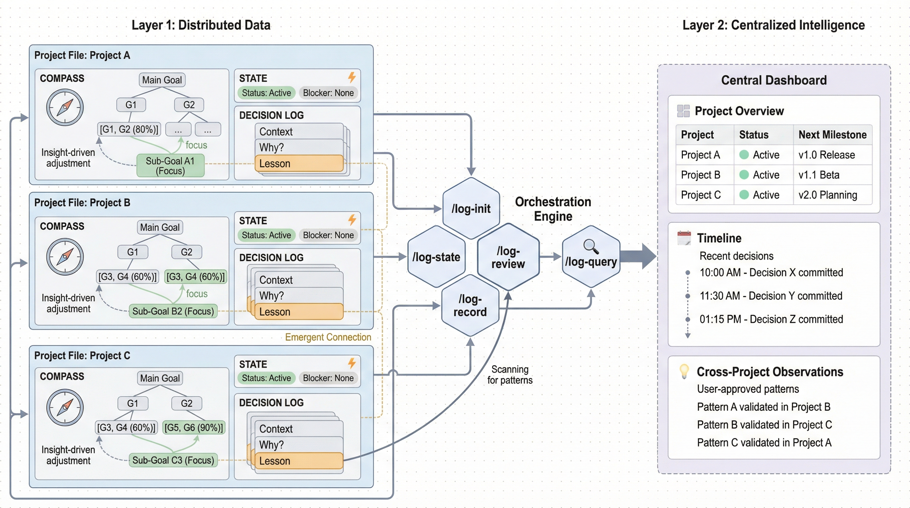

<p align="center">
  
</p>

<h1 align="center">Research Log</h1>

<p align="center">
  <strong>Compass + State + Decision Log for multi-project researchers</strong><br/>
  <em>Know where you're headed, where you left off, and why you made each decision.</em>
</p>

<p align="center">
  <a href="https://github.com/Axect/research-log/stargazers"></a>&nbsp;
  &nbsp;
  
</p>

<p align="center">
  <a href="#the-problem">The Problem</a> &bull;
  <a href="#the-solution">The Solution</a> &bull;
  <a href="#get-started">Get Started</a> &bull;
  <a href="#skills">Skills</a> &bull;
  <a href="#file-structure">Structure</a>
</p>

---

## The Problem

Multi-project researchers face three recurring pain points:

1. **Experiment knowledge decay** — After dozens of experiments, *why* a scenario succeeded or failed becomes vague
2. **Direction loss** — Deep in implementation details, you drift from the main research question
3. **Context reboot** — Switching between projects, you can't quickly recover *what you were doing, why, and what's next*

## The Solution

Each project gets **one file** with **three sections**, each solving one problem:

| Section | Solves | Read When |
|---------|--------|-----------|
| **Compass** | Direction loss | Feeling lost in details |
| **State** | Context reboot | Returning to a project |
| **Decision Log** | Knowledge decay | Wondering why a past decision was made |

**Compass** is a goal tree with completion percentages. When you're deep in CVAE debugging, you can see: "I'm at G2.2a → G2.2 → G2 → Main Goal." It's a ladder out of the details.

**State** is a 6-line session snapshot. Read it in 2 minutes when you come back to a project: what was I doing, what's the blocker, what's next.

**Decision Log** records each significant decision with a thorough **Why analysis** — not just what happened, but a cause chain, domain-specific reasoning, and generalizable lessons. AI drafts the analysis; you review and approve.

A central **dashboard** shows all projects at a glance.

## Get Started

### Prerequisites

| Requirement | Purpose | Required? |
|-------------|---------|-----------|
| [Claude Code](https://docs.anthropic.com/en/docs/claude-code) | Plugin host | **Yes** |

### Installation

**1. Add the marketplace and install** (in your terminal):
```bash
claude plugin marketplace add Axect/research-log
claude plugin install research-log
```

**2. Register your first project** (inside Claude Code):
```
/log-init
```

Interactive setup — asks for project info and generates the Compass + State + Decision Log file.

<details>
<summary><strong>Alternative: Local Development</strong></summary>

```bash
git clone https://github.com/Axect/research-log.git
claude --plugin-dir /path/to/research-log
```
</details>

## Skills

| Skill | Description | Frequency |
|-------|-------------|-----------|
| `/log-init` | Register a new project | Once per project |
| `/log-record` | Record a Decision Log entry with Why analysis | After experiments/decisions |
| `/log-state` | Update State snapshot | Auto (session-end hook) |
| `/log-review` | Compass alignment + cross-project patterns + dashboard | Weekly (~15 min) |
| `/log-query` | Search logs, answer questions | On demand |

### `/log-init`

```
/log-init
```

Interactive — asks for project name, slug, repo path, main goal, and sub-goals. Generates the project file and updates the dashboard. Can pre-populate from existing `CLAUDE.md` and memory files.

### `/log-record`

```
/log-record                         # AI infers topic from recent work
/log-record "CVAE collapse analysis"  # Provide topic hint
```

AI gathers context (git diffs, configs, experiment outputs), drafts a Decision Log entry with full Why analysis, and presents it for your review. Also proposes Compass percentage updates if progress was made.

### `/log-state`

```
/log-state                          # Manual invocation
```

Primarily called by the **session-end hook** — updates the State section automatically when you finish working. Can also be called manually. Identifies the project from your current working directory.

### `/log-review`

```
/log-review
```

Weekly review (~15 minutes):
1. **Compass alignment**: flags if recent work drifted from the current focus
2. **Cross-project patterns**: scans Decision Logs for shared failure modes or transferable lessons
3. **Dashboard regeneration**: updates project cards and timeline from current data
4. **Archive management**: proposes moving old Decision Log entries to archive files

### `/log-query`

```
/log-query "Why did we abandon approach X in ProjectA?"
/log-query "What did I work on last month?"
/log-query "Lessons learned about inverse problems"
```

Searches project files and archives, synthesizes answers with citations to specific Decision Log entries.

## File Structure

```
~/.research-log/
├── dashboard.md              # All projects at a glance
├── .locks/                   # Per-project flock files
│   ├── project-a.lock
│   └── project-b.lock
├── project-a.md              # Compass + State + Decision Log
├── project-a-decisions-2025.md  # Archived entries (when file grows)
└── project-b.md
```

### Example Project File

```markdown
# ProjectA — Example Research Project

## Compass

### Main Goal
Build a model for the target research problem.

### Sub-goals
- **G1. Data Pipeline** [100%]
- **G2. Model Development** [40%]
  - G2.1 Baseline model [100%]
  - G2.2 Advanced model [20%] ← current focus
- **G3. Paper Submission** [10%]

---

## State
- **Session**: 2026-04-05T14:30
- **Last session**: 2026-04-03T16:00
- **Location**: G2.2a
- **Working on**: Loss convergence test
- **Current status**: Loss oscillating after epoch 50
- **Blocker**: Training instability
- **Next step**: Try learning rate schedule
- **Compass link**: G2.2 Advanced model

---

## Decision Log

### 2026-04-05 | Training instability analysis

**Context**: G2.2a — Advanced model training

**Tried**: Standard training (default hyperparameters)
**Expected**: Smooth convergence
**Got**: Loss oscillation after epoch 50

**Why analysis**:
1. Learning rate too aggressive from the start
2. Data has high variance → unstable gradients
3. Literature suggests warm-up schedule as standard fix

**Conclusion**: Try learning rate warm-up schedule
**Lesson**: For high-variance data, always start with a warm-up schedule
```

## Key Principles

- **No forced connections** — Cross-project links emerge only from Decision Log lessons, with user approval
- **AI drafts, user decides** — No automatic writes without approval (except State via hook)
- **Concurrency safe** — Per-project `flock` ensures parallel sessions don't corrupt files
- **Minimal overhead** — State updates automatically; Decision Log is the only manual action

## License

MIT
