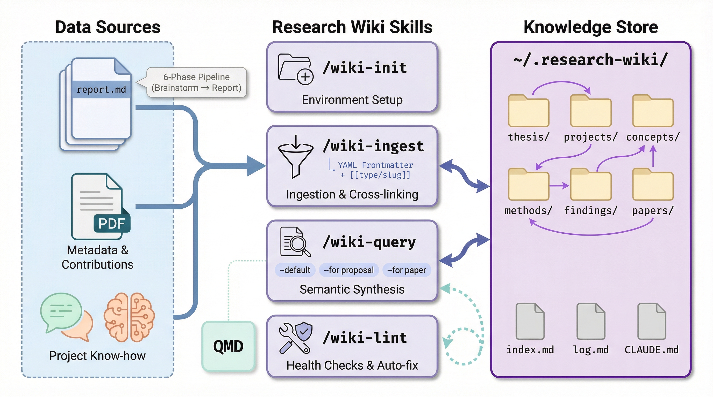

<p align="center">
  
</p>

<h1 align="center">Research Wiki</h1>

<p align="center">
  <strong>LLM-maintained research knowledge base for Claude Code</strong><br/>
  <em>Accumulate findings across projects. Query your own research history. Keep knowledge healthy.</em>
</p>

<p align="center">
  <a href="https://github.com/Axect/research-wiki/stargazers"></a>&nbsp;
  &nbsp;
  
</p>

<p align="center">
  <a href="#why-a-research-wiki">Why?</a> &bull;
  <a href="#get-started">Get Started</a> &bull;
  <a href="#skills">Skills</a> &bull;
  <a href="#wiki-structure">Structure</a> &bull;
  <a href="#integration-with-magi-researchers">MAGI Integration</a>
</p>

---

Inspired by Andrej Karpathy's [llm-wiki](https://gist.github.com/karpathy/442a6bf555914893e9891c11519de94f), but specialized for scientific research: structured page types, MAGI pipeline integration, thesis-driven cross-referencing, and wiki health checks.

## Why a Research Wiki?

Research generates artifacts (MAGI reports, paper notes, experimental findings, project lessons) but they scatter across directories and fade from context. A week later, you re-discover the same pitfall. A month later, you forget which experiment settled a question.

Research Wiki maintains a **persistent, structured knowledge base** at `~/.research-wiki/` that Claude can read and write:

- **Ingest** selectively: only commit knowledge worth keeping
- **Query** across projects: "What do we know about operator learning?" pulls from every ingested source
- **Lint** for health: catch broken links, orphan pages, stale content, and contradictions

## Get Started

### Prerequisites

| Requirement | Purpose | Required? |
|-------------|---------|-----------|
| [Claude Code](https://docs.anthropic.com/en/docs/claude-code) | Plugin host | **Yes** |
| [MAGI Researchers](https://github.com/Axect/magi-researchers) | Primary source of research outputs to ingest | Recommended |
| [QMD](https://github.com/tobi/qmd) | Semantic search over wiki pages in `/wiki-query` | Optional |
| [arXiv Explorer](https://github.com/Axect/arxiv-explorer) | Paper metadata lookup in `/wiki-ingest paper` | Optional |

> Research Wiki works standalone. You can ingest findings and know-how without MAGI, but the richest workflow comes from ingesting MAGI's structured outputs.

### Installation

**1. Install the plugin** (inside Claude Code):
```
/plugin marketplace add Axect/research-wiki
/plugin install research-wiki@research-wiki
```

**2. Initialize the wiki:**
```
/wiki-init
```

This creates the directory structure, `CLAUDE.md`, `index.md`, and `log.md` at `~/.research-wiki/`.

**3. Ingest your first source:**
```
/wiki-ingest magi outputs/topic_20260408_v1/
```

<details>
<summary><strong>Alternative: Local Development</strong></summary>

```bash
git clone https://github.com/Axect/research-wiki.git
claude --plugin-dir /path/to/research-wiki
```
</details>

## Skills

| Skill | Description |
|-------|-------------|
| `/wiki-init` | Initialize wiki directory structure at `~/.research-wiki/` (idempotent) |
| `/wiki-ingest` | Ingest MAGI reports, papers, findings, or project know-how into wiki pages |
| `/wiki-query` | Search the wiki and synthesize answers with `[[page]]` citations |
| `/wiki-lint` | Health-check for broken links, orphan pages, stale content, and index drift |

### `/wiki-init`

```
/wiki-init
```

Creates `~/.research-wiki/` with all type directories, `CLAUDE.md` (operating rules + page conventions), `index.md`, and `log.md`. Safe to run multiple times; skips anything that already exists.

### `/wiki-ingest`

```
/wiki-ingest magi <path>           # Ingest a MAGI research output
/wiki-ingest paper <arxiv-id>      # Ingest an arXiv paper
/wiki-ingest finding "<desc>"      # Record an experimental finding
/wiki-ingest knowhow <project>     # Extract project know-how
```

Reads the source, plans which pages to create/update, and waits for your approval before executing. Updates `index.md` and `log.md` automatically.

### `/wiki-query`

```
/wiki-query "What do we know about operator learning for PDEs?"
/wiki-query --for proposal "Summarize the OSPREY project"
/wiki-query --for paper "Evidence for recoverability in neural approximation"
```

Searches wiki pages, synthesizes an answer with `[[type/slug]]` citations, and optionally files the answer as a new wiki page if it has reuse value.

### `/wiki-lint`

```
/wiki-lint                        # Run all checks
/wiki-lint --fix                  # Auto-fix fixable issues
/wiki-lint --check broken-links   # Run a specific check
```

Seven checks: `broken-links`, `orphans`, `stale`, `missing`, `contradictions`, `thesis-gaps`, `index-sync`.

## Wiki Structure

```
~/.research-wiki/
  CLAUDE.md         # Operating rules and page conventions
  index.md          # Page inventory (one entry per page)
  log.md            # Reverse-chronological operation log
  thesis/           # Research narratives and central claims
  projects/         # Per-project status, know-how, findings
  concepts/         # Physics & ML concept definitions
  methods/          # Techniques, architectures, what works/fails
  findings/         # Experimental results, failures, lessons
  papers/           # Literature interpretation (not metadata)
  raw/              # Immutable source symlinks (never modified)
```

### Page Conventions

Every page has YAML frontmatter:

```yaml
---
title: "Page Title"
type: concept | method | project | finding | paper | thesis
created: 2026-04-08
updated: 2026-04-08
tags: [operator-learning, deeponet]
projects: [osprey]
sources: []
---
```

Cross-references use `[[type/slug]]` wikilinks (e.g., `[[methods/deeponet]]`, `[[projects/osprey]]`). See `shared/conventions.md` for the full specification.

## Integration with MAGI Researchers

Research Wiki is designed to work alongside [MAGI Researchers](https://github.com/Axect/magi-researchers) but is **not bundled with it**. The two plugins have complementary responsibilities:

| | MAGI Researchers | Research Wiki |
|--|------------------|---------------|
| **Purpose** | Execute research (one-shot pipeline) | Accumulate knowledge (persistent store) |
| **Data flow** | Input → 6-phase pipeline → `outputs/` | Source → Ingest → `~/.research-wiki/` |
| **Lifecycle** | Ephemeral (isolated per run) | Long-lived (grows across projects) |
| **When to use** | "Run a study on X" | "What did we learn from X?" |

### Why They're Separate

MAGI runs a 6-phase research pipeline (brainstorm, plan, implement, execute, test, report) and writes everything to `outputs/{topic}_{date}_v{N}/`. But those outputs are **project-local and ephemeral**. A month later, the insights are buried in a directory you've forgotten about.

Research Wiki fills this gap. You selectively ingest MAGI outputs into a persistent, cross-referenced knowledge base that Claude can query across all your projects.

Not every MAGI output is wiki-worthy. You review the report first, then decide what to keep.

### What Gets Ingested from MAGI

When you run `/wiki-ingest magi <path>`, the skill reads the MAGI output directory:

```
outputs/topic_20260408_v1/
├── report.md                    ← Primary source: synthesized findings
├── brainstorm/synthesis.md      ← Cross-model ideas and ranked directions
├── plan/research_plan.md        ← Methodology and approach
├── plan/murder_board.md         ← Identified risks and limitations
└── results/                     ← Experimental data and metrics
```

From these, the skill creates and updates wiki pages:

| MAGI Source | Wiki Page Type | Example |
|-------------|----------------|---------|
| Key findings from `report.md` | `findings/` | `findings/deeponet-outperforms-fno.md` |
| Novel method from `plan/` | `methods/` | `methods/physics-informed-deeponet.md` |
| New concept introduced | `concepts/` | `concepts/branch-trunk-architecture.md` |
| Project-level summary | `projects/` (update) | Adds to `projects/osprey.md` Key Findings |
| Evidence for/against thesis | `thesis/` (update) | Updates `thesis/recoverability.md` Evidence |

### Typical Workflow

```
1. /research "operator learning for Vlasov equation"    # MAGI runs 6-phase pipeline
2. (review report.md, decide what's worth keeping)
3. /wiki-ingest magi outputs/vlasov_20260408_v1/        # Ingest into wiki
   → Creates: findings/vlasov-operator-accuracy.md
   → Creates: methods/fourier-deeponet.md
   → Updates: projects/osprey.md (new findings + know-how)
   → Updates: thesis/operator-universality.md (new evidence)
4. /wiki-query "How does this compare to previous PDE results?"
   → Synthesizes answer from all ingested findings across projects
```

### Non-MAGI Sources

Research Wiki is not MAGI-exclusive. You can ingest from any source:

```
/wiki-ingest paper 2106.03456              # arXiv paper
/wiki-ingest finding "Adam diverges with lr>1e-3 on this loss surface"
/wiki-ingest knowhow osprey               # Extract lessons from a project's memory
```

## License

MIT
